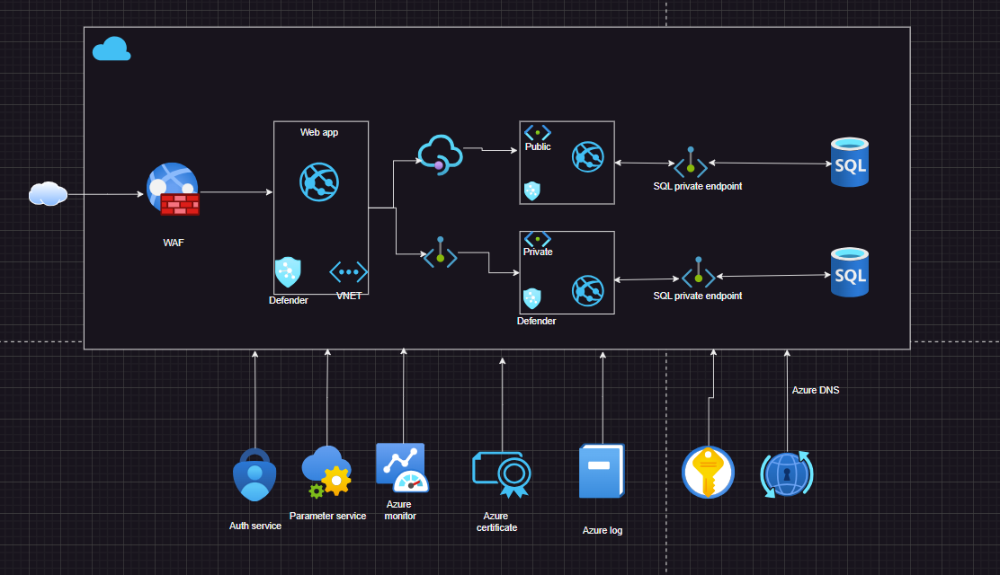

# Bank Cloud Infrastructure Project

Overview
This README documents the setup, approach, and potential improvements application. The infrastructure supports a Frontend web app and two backend services, integrating with a third-party and databases.

## Architecture

## Infrastructure as Code
The entire infrastructure is defined using Terraform. The Terraform code is organized into reusable modules to avoid duplication and promote maintainability
Example - app service module
          private endpoint module

## Security Considerations
Database is isolated in a private subnet and can be accessed by private endpoint
All sensitive information is stored in Azure Key Vault.
Network Security Groups (NSGs) are implemented to control traffic flow.
Azure WAF is used to protect the application

## Scalability and High Availability
Azure app Service is used to deploy application code because of easy to deploy, auto scaling, high availability and always on features 
Azure Application Gateway is implemented for load balancing and SSL termination.
Azure API management for better control, monitoring, and documentation of APIs.

## Components
### React Web App
- A web Application hosted on Azure App Service and pointing toward the WAF to provide from internet

### Backend Service #1
- Azure App Service is used along with private endpoint for database connection and communication with frontend channels 
- Deployed SQL database.
- Added inbound and outbound rule control the communication (except the IP range of the core banking system, 203.0.113.0/24).

### Backend Service #2
- Azure App Service is used along with private endpoint for database connection and API management to communicate with frontend channels 
- Deployed SQL database.
- used API management service to rate limited to 10rps.
- Service can freely connect outbound to the public internet.

## Setup

### Prerequisites
- Azure subscription
- Azure CLI
- Terraform

### Execution/Deployment
Deployment can be performed through CICD pipeline or manually running commands-
Clone git repo
terraform init
terraform plan
terraform apply

## CI/CD Pipeline
The CI/CD pipeline is defined in the [deploy.yaml] to deploy infra and build application code.

## What can be improved:
- Enhanced Security Measures
- Monitoring and Alerting service can be added
- Application is missing appropriate tagging 
- Containerization Strategy can be followed for cloud agnostic design
- IAM policies can be added to enhance security and access control
- Terraform composition can be created to improve readability and reduce duplication further. 